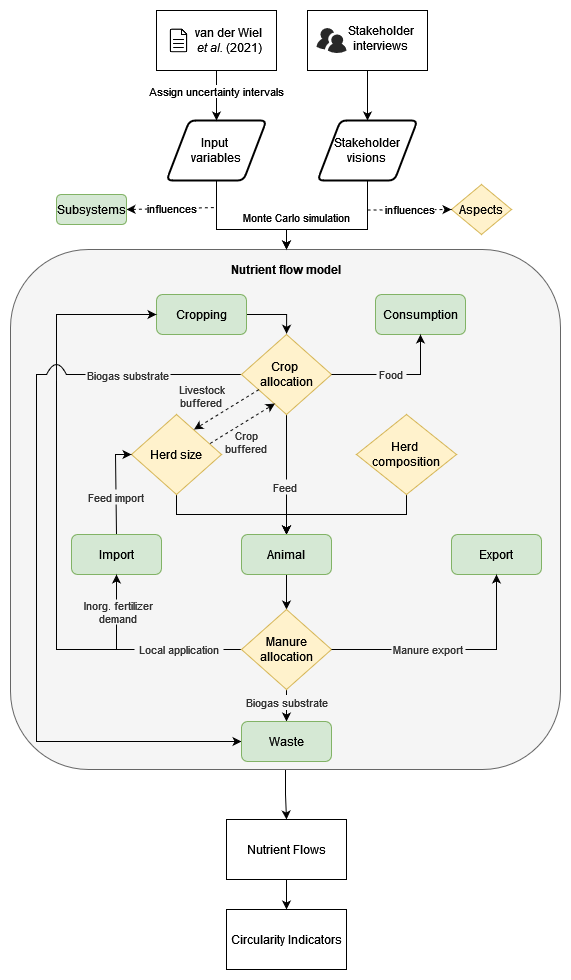
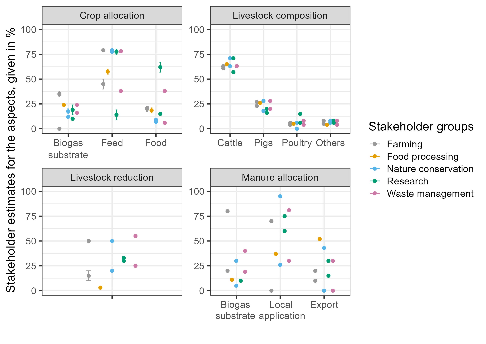
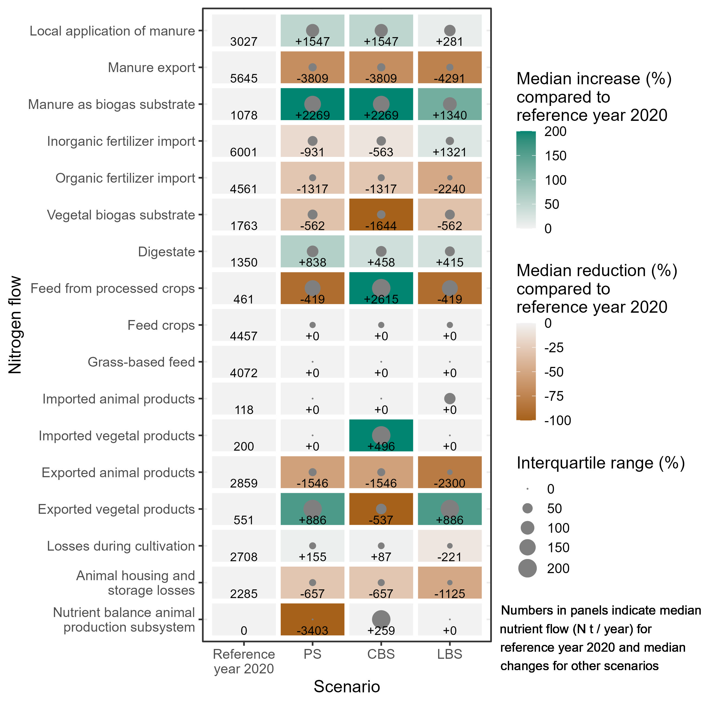
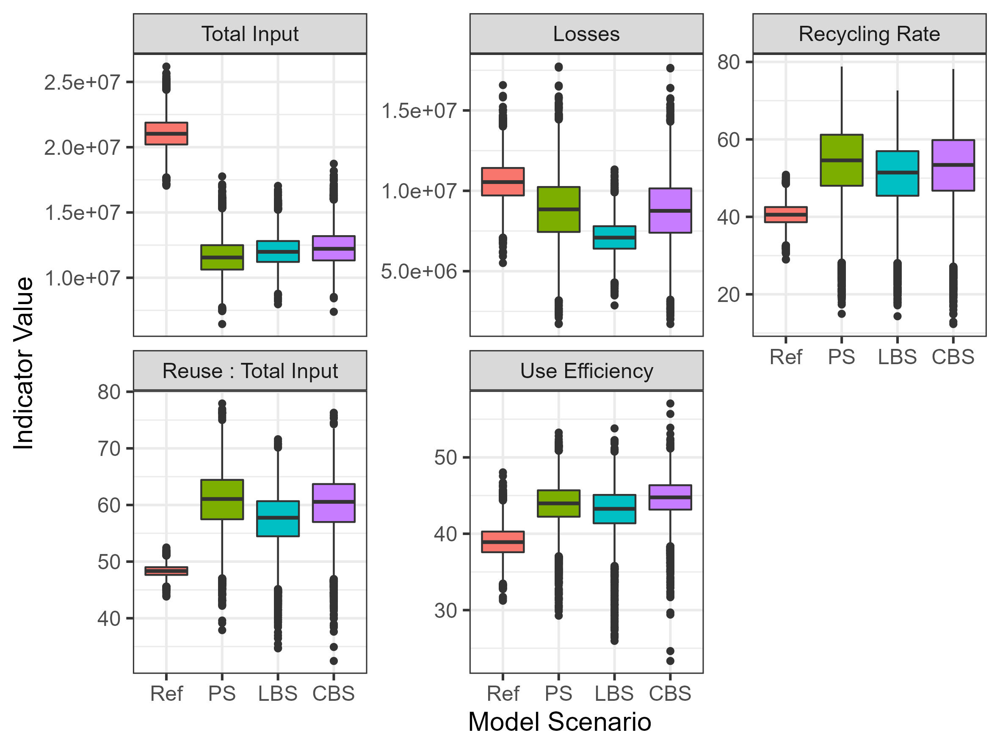
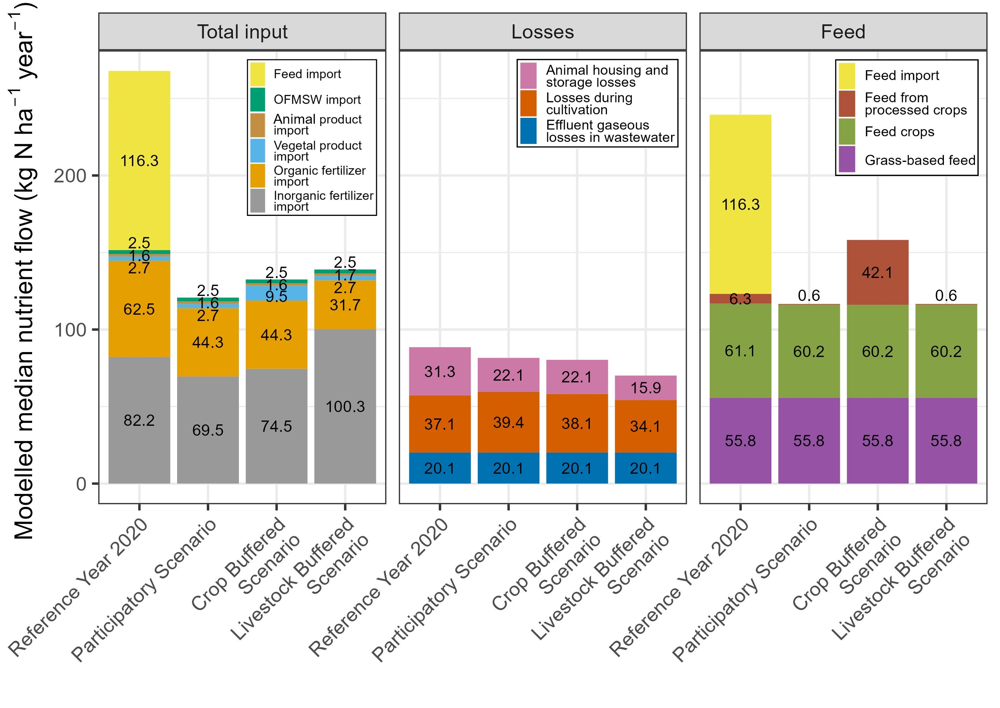

```{r setup, include=FALSE}
knitr::opts_chunk$set(echo = TRUE)
```

[](https://doi.org/10.5281/zenodo.10222535)

## What is this repo about?

As the title already says, we want to investigate nutrient flows for the district of Kleve, Germany. The agricultural sector of Kleve is intense and often export oriented. Animal husbandry (especially dairy cows) plays an important role along side with other intense farming systems like cropping (for example potatos) or ornamental production. Furthermore, Kleve is home to many food processors. 
A review of substance flow analyses showed, that supply and demand of the agro-food-waste system has become detached [@vdwiel2020review]. This is also the case for Kleve, whose substance flow has become more linear with a large share of imports and exports [@van2021restoring]. This repo builds upon the work of @van2021restoring, who mapped the substance flows for nitrogen (N), phosphorous (P), potassium (K) and to a lesser extent carbon (C). We updated the substance flow anaylsis for 2020.

The main goal of this project is to explore socially acceptable solutions of circularity as measure to reduce nitrogen (N) losses and prevent environmental damage. We did that by combining the findings of the (updated) traditional substance flow analysis approach with local perspectives of stakeholders of the agro-food-waste system in Kleve. A schematic representation of the workflow can be seen in the figure blow. In previous studies the large imports of animal feed were identified as a main contributor for reduced nutrient circularity in the district of Kleve [@@van2021restoring]. Based in this observation, we constructed a scenario in which feed imports were inhibited. To understands possible implications of that scenario, we gathered the perspective of local stakeholders via questionnaires and one-to-one interviews. We gathered the input of the stakeholders on four main aspects: 1) allocation of crops to animals, export and biogas substrate 2) composition of livestock herd 3) changes in overall size livestock in Kleve, and 4) allocation of manure to crops, export and manure as biogas substrate. We incorporated the stakeholder perspectives into the scenario. We calculated nutrient flows for the reference year and scenario and based on these calculated circularity indicators. 

```{r,out.width = "70%", echo = FALSE,fig.align='center', fig.show='hold', fig.cap="Methodological approach from base model and different uses of the stakeholder visions in the scenarios to modelling nutrient flows and circularity indicators."}


```

Here is the answers of the stakeholders on the four aspects of the scenario. Note that most stakeholders were not able to provide their answers in ranges, which is usually the preffered approach for decision analysis studies. It was not possible to conduct stakeholder workshops, so we opted for questionnaires followed up by one-on-one interviews. 

```{r,out.width = "60%", echo = FALSE,fig.align='center', fig.show='hold', fig.cap="The stakeholder input at each aspect: allocation of crops, composition of livestock, livestock population and allocation of manure. Each point is an answer from a stakeholder. The answers were given by the stakeholders in percentages, such as the percentages of crops allocated to biogas substrate, feed and food. The allocation of crops and the allocation of manure are given in percentage of N. The points with an error bar were answers by stakeholders that were given as a range. The colours represent the different groups of stakeholders involved.  The group Farming consisted solely of animal production."}


```


The analysis was carried out using a Monte-Carlo simulation with 10000 runs per scenario. We observed a mismatch in the crops allocated to feed the livestock and the expacted changes in livestock size. In the participatory scenario, we did not resolve that mismatch resulting in more nutrients leaving the animal subsystem than entering it. We furthermore explore two ways to resolve the mismatch: 1) ignore the stakeholder proposed allocation of crops to animals and instead allocate as much crops as the estimated herdsize would require ("crop buffered scenario" or "CBS") or 2) ignore the stakeholder proposed livestock herdsize and reduce the herdsize so that its nutrient demand can be satisfied by the stakeholder-proposed crop allocation ("livestock buffered scenario" or "LBS"). We mapped median changes of most relevant nutrient flows in the figure below, which we adopted from @fernandez2022prioritizing.

```{r,out.width = "60%", echo = FALSE,fig.align='center', fig.show='hold', fig.cap="N Flow differences for each scenario (participatory scenario (PS), crop-buffered scenario (CBS) and livestock-buffered scenario (LBS)) compared to the reference year 2020. Brown tiles indicate a decrease as compared to the reference year and green tiles indicate an increase as compared to the reference year. The grey circles indicate the interquartile range of the relative change, which is the distance of the 75% and 25% quantile. Numbers in tiles indicate median nutrient flow (t N year-1) for the reference year and changes in nutrient flow (t N year-1) for the scenarios PS, CBS and LBS compared to the reference year. The negative nutrient balance for the animal production subsystem for PS conveys that there is a deficit in the amount of N supplied to animals as feed."}


```

Based on the modelled nutrient flows, we calculated circularity indicators for the reference year, unaltered participatory scenario, crop buffered scenario, and livestock buffered scenario. 

```{r,out.width = "70%", echo = FALSE,fig.align='center', fig.show='hold', fig.cap="Boxplots depicting the circularity indicators for the reference year (2020) and the three scenarios: Participatory Scenario (PS), Crop Buffered Scenario (CBS) and Livestock Buffered Scenario (LBS). The box of the boxplot contains 50%, which lies between 25% and 75% percentile. The whisker is the 25 % percentile minus 1.5 * interquartile range for the lower end and 75% percentile + 1.5 IQR for the upper end"}


```

We also mapped the median composition of the total input, the nutrient losses and of the feed allocated to livestock. 

```{r,out.width = "70%", echo = FALSE,fig.align='center', fig.show='hold', fig.cap="Total input, Losses and feed composition for the reference year and the different scenarios, expressed in t N year-1 ha-1 agricultural land."}


```

The model also provides estimates on potassium (K) and phosphorous (P) nutrient flows, which we decieded to not take into the final analysis, as it was tricky to maintain the stochiometry of the nutrient flows. 

Further challenges lied in how to include the stakeholder answers into the model especially when the answers were clustered in different intervals. In case the answers are evenly spread, there is no problem in including the answers in normal distributions as it is usually done in decision analysis projects using the R package `decisionSupport` [@decisionSupport]. In some cases used normal distributions and in others we chose skewed normal distributions. For more details on that, please refer to this [github repository](https://github.com/hortibonn/including-unreliable-stakeholder-estimates-of-small-n).


## References
