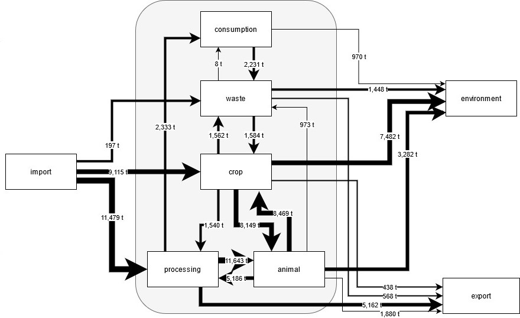
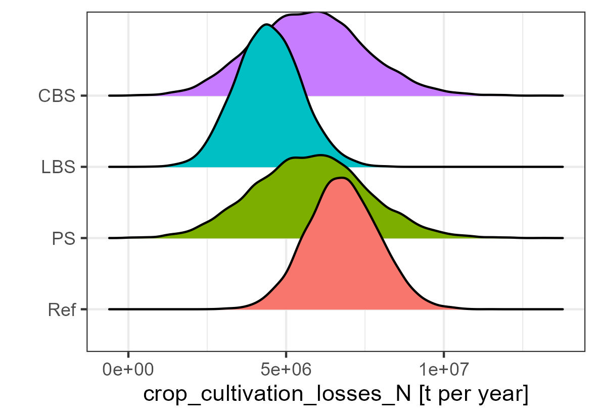
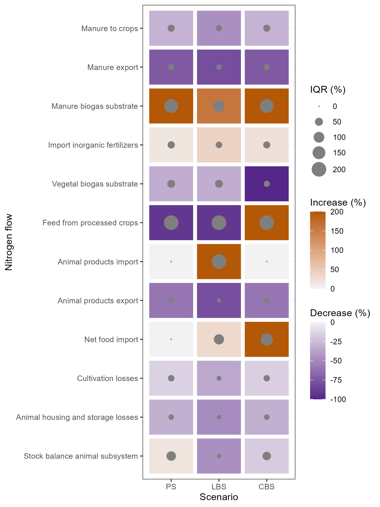

```{r setup, include=FALSE}
knitr::opts_chunk$set(echo = TRUE)
```

## What is this repo about?

As the title already says, we want to investigate nutrient flows for the district of Kleve, Germany. The agricultural sector of Kleve is intense and often export oriented. Animal husbandry (especially dairy cows) plays an important role along side with other intense farming systems like cropping (for example potatos) or ornamental production. Furthermore, Kleve is home to many food processors. 
A review of substance flow analyses showed, that supply and demand of the agro-food-waste system has become detached [@vdwiel2020review]. This is also the case for Kleve, whose substance flow has become more linear with a large share of imports and exports [@van2021restoring]. This repo builds upon the work of @van2021restoring, who mapped the substance flows for nitrogen (N), phosporous (P), potassium (K) and to a lesser extent carbon (C). A simplified example of the traditional output of substance flow analysis can be seen in the figure below. Originally there were several substance flows between the subsystems within Kleve and flows entering and leaving the district. However, for the sake of simplicity they were lumped together. For a more detailed figure, please refer to @van2021restoring.


```{r,out.width = "70%", echo = FALSE,fig.align='center', fig.show='hold', fig.cap="Nitrogen SFA with flows in ton year-1. I=import E=export. WwT=wastewater treatment."}


```

However, the analysis suffered from some shortcomings. In principle the study acknowledged uncertainty in the SFA calculations by assigning different uncertainty levels to the calculated flows, based on the reliability of the input data. However, the uncertainty only is introduced in the last step, while it was ignored in the actual calculations. This leads to an underestimation of the actual uncertainty involved when calculating the substance flows. In this repository, the uncertainty of each input was assessed and a Monte-Carlo simulation with the uncertainty inputs was carried out.
More importantly, we investigated the impact of different scenarios on the substance flow of the system. We were especially interested in the effect of enforcing a higher share of local feed to the animals. For the beginning, we worked on an extreme scenario in which all the feed needs to be locally sourced. Stakeholders coming from different industries (farming, food processing, waste treatment, environment, research) were interviewed on possible implications of the scenario. The answers of that approach were then integrated into the existing model. This approach is sometimes also called participatory modelling.

The outcomes of a Monte-Carlo simulation is usually in form distributions, an example can be seen in case of crop cultivation losses for nitrogen. The shown scenarios are the Reference year 2020 (Ref), the participatory scenario (PS) of strict local feed, livestock buffered scenario (LBS) of local feed and the crop buffered scenario (CBS) of local feed. The latter two scenarios are modifications of the participatory scenario, because often the stakeholder expectations were not well synchronized with each other leading to over- or under-allocations of different substance flows. Especially the allocation of crops to animals and the expected change in livestock herd size. So we decided to either let the herdsize buffer the unfitting ratio of allocated feed to herdsize (LBS) or a more drastic change in crop allocation buffers the missmatch (CBS).


```{r,out.width = "70%", echo = FALSE,fig.align='center', fig.show='hold', fig.cap="N"}


```

The project investigated in total 44 different substance streams for three nutrient and four scenarios (including the reference year), which leads to a total of 528 resulting individual distributions. One of a the projects challenge was to summarize the results. 
One approach was to look at different circularity indicators, which includes the amount of total inputs, environmental losses, share recycling within the agro-food-waste system, the use efficiency and the share of reuse to total inputs (citation here). Another approach was to map the median change relative to the reference year for selected substance flows or indicators together with the interquartile range of the distributions. This approach was adopted from [@fernandez2022prioritizing]. An example for selected flows for nitrogen can be seen in the figure below.

```{r,out.width = "60%", echo = FALSE,fig.align='center', fig.show='hold', fig.cap=""}


```

Also classical boxplots for the circularity indicators can be an option, as we can see for the circularity indicators for nitrogen.

```{r,out.width = "70%", echo = FALSE,fig.align='center', fig.show='hold', fig.cap=""}
knitr::include_graphics('example_figures/boxplot_indicators_N.jpeg')

```


Further challenges lied in how to include the stakeholder answers into the model especially when the answers were clustered in different intervals. In case the answers are evenly spread, there is no problem in including the answers in normal distributions as it is usually done in decision analysis projects using the R package `decisionSupport` [@decisionSupport]. In some cases used normal distributions and in others we chose skewed normal distributions. For more details on that, please refer to this [github repository](https://github.com/hortibonn/including-unreliable-stakeholder-estimates-of-small-n).


## References
