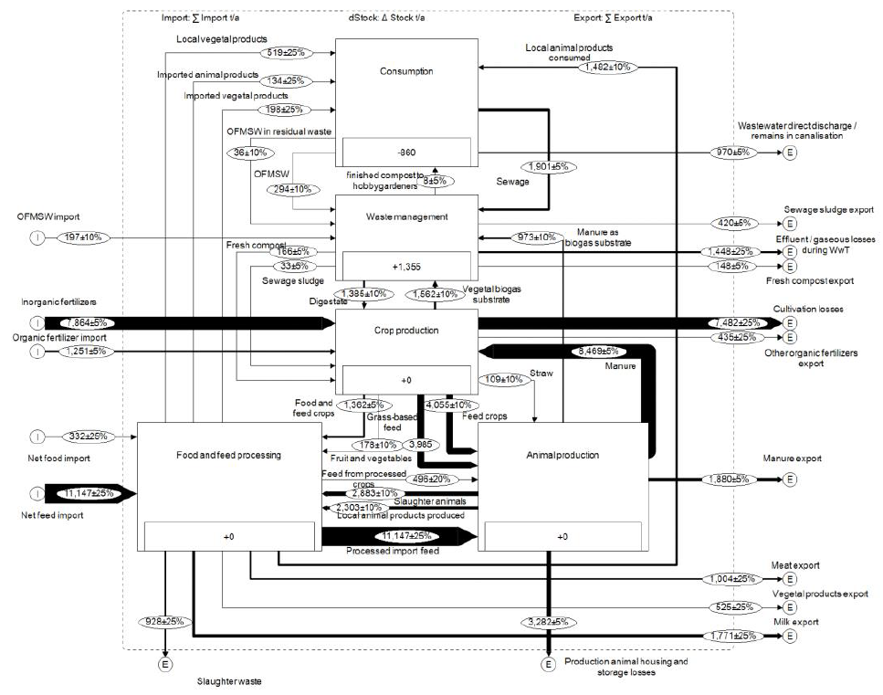
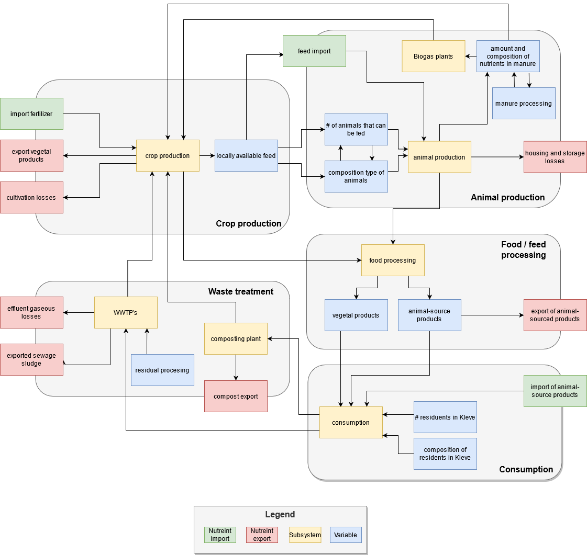

```{r setup, include=FALSE}
knitr::opts_chunk$set(echo = TRUE)
```

## Imports and exports of nutrients are unbalanced

Regions with intensive agriculture often show environmental problems caused by nutrient excess of agro-food-waste systems that have become increasingly linear over previous decades. Local demand and supply of nutrients increasingly become detached from each other. Substance flow analysis of nutrient should consider the whole agro-food-waste system including crop prdocution, animal production, food and feed processing, consumtption, and waste management [@vdwiel2020review] Substance flow analysis (SFA) of Kleve, Germany, for instance revealed that especially the animal keeping of such an export oriented district drives the nutrient flows. Roughly 40%, 45% and 65% of districts N, P and K flows, respectively, can be accounted to feed import, manure application, and losses from housing and manure storage [@vdWiel2021SFA]. 


```{r,out.width = "100%", echo = FALSE,fig.align='center', fig.show='hold', fig.cap="Nitrogen SFA with flows in ton year-1. I=import E=export. WwT=wastewater treatment."}


```


## Participatory research towards a more circular nutrient management

Facing the intensifying negative impacts of a decoupled demand and supply of nutrients intesified efforts towards nurtient recycling within the systems can be expected in the future. For instance the in 2017 legislated decree on sewage sludge 
(Kläschlammverordnung) states, that in 2032 the latest most of the waste water treatment plants need to use a technology
to improve the phosphorous retrieval from wastewater. More changes towards a more circular nutrient 
manageement are plausible, but how could they look like and what would be the consequences? To elaborate these questions
the decision analysis method will be utilized. Originally developed for consulting on business decisions, the method
attained increasing attention to assist in risky agricultural decisions [@luedeling2016decision] such as the adoption of agroforestry practices [@do2020decision] or the installation of hail nets in fruit orchards [@rojas2021adapting]. Advantages of the method include participatory approach involving stakeholders in the model development and making use of expert knowledge for parametrization. Especially the ability to handle uncertainty, which is in SFA surely present, makes the decision analysis approach viable for this project. Furthermore, the spark of farmer protests in Germany and elsehere in the response to tighter envrionmental legislation underlines the need to participatory research and policy making. 

## Outcomes sofar

Usually, participatory methods such as decision analysis rely on workshops held in presence, which are in light of the current situation not feasable. Sofar response rates, espcially in the agricultural subsystem, were low to digital meeting, therefore the first draft of a visual model, one of the first steps in such a workshop, was instead carried out by us researchers (include figure). Sofar it resembles the previously shown SFA outcome, but especially the addition of animal numbers and fodder composition are expected to affect the substance flows. 


```{r,out.width = "80%", echo = FALSE,fig.align='center', fig.show='hold', fig.cap="Graphical model of agro-food-waste system"}


```


Right now, the team is busy recreating the SFA in R so that the substance flows can modelled in terms of distributions instead of single numbers. First results of this effort can be seen below.


```{r,out.width = "50%", echo = FALSE,fig.align='center', fig.show='hold', fig.cap="Entering and leaving flows of the animal subsystem"}
knitr::include_graphics(c('figures/animal_inputs.png','figures/animal_outputs.png'))

```


```{r,out.width = "50%", echo = FALSE,fig.align='center', fig.show='hold', fig.cap="Import and export of food (excluding crops) in Kleve"}
knitr::include_graphics(c('figures/food_import.png','figures/food_export.png'))

```

## Challenges and what to do

Participatory research is done best when stakeholders are interested in the outcomes and have a shared problem awareness. Reaching out and activating stakeholders lead to minimal sucess. Furthermore, the implementation of SFA in R is still carried out. The number of involved variables for the baseline scenario (which are more or less the findings of the SFA) involve around 250 parameters, even though only the animal subsystem is completely implemented so far. An even bigger challange is to formulate the scenario and its implications of a strict circular nutrient management, which we plan to compare with the baseline scenario.

## References

