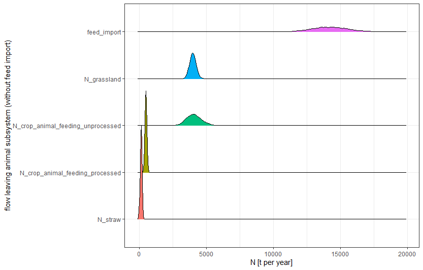
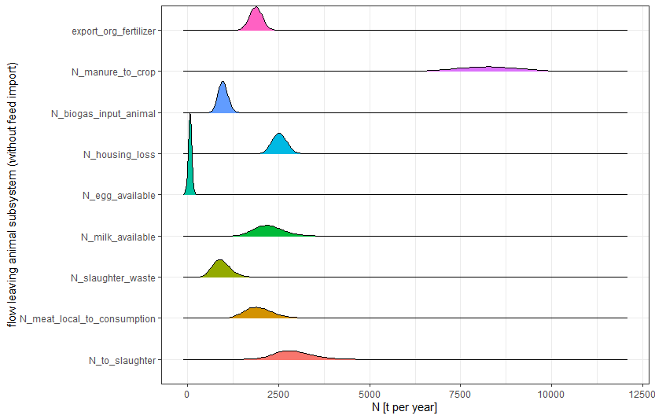
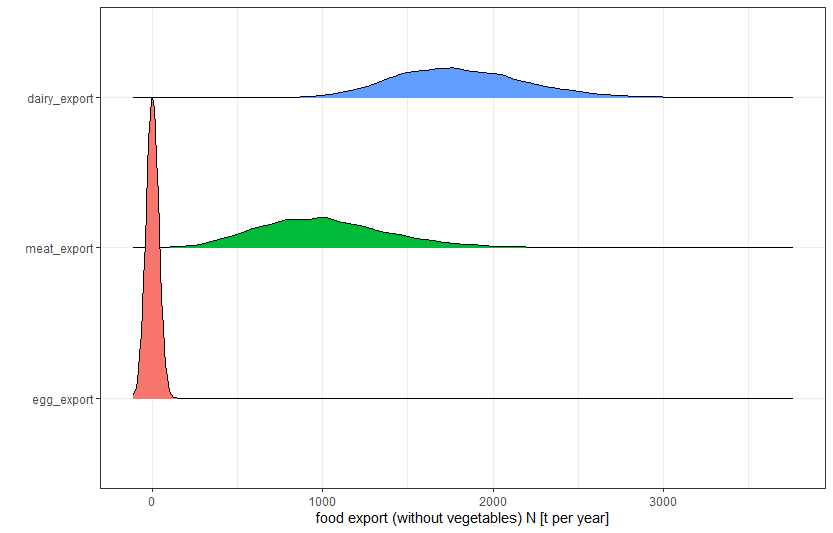

Decision Analysis on nutrient flows in Kleve, Germany
================
L. Caspersen
6/29/2021

## Imports and exports of nutrients are unbalanced

Regions with intensive agriculture often show environmental problems
caused by nutrient excess of agro-food-waste systems that have become
increasingly linear over previous decades. Local demand and supply of
nutrients increasingly become detached from each other. Substance flow
analysis of nutrient should consider the whole agro-food-waste system
including crop prdocution, animal production, food and feed processing,
consumtption, and waste management (Wiel et al. 2020) Substance flow
analysis (SFA) of Kleve, Germany, for instance revealed that especially
the animal keeping of such an export oriented district drives the
nutrient flows. Roughly 40%, 45% and 65% of districts N, P and K flows,
respectively, can be accounted to feed import, manure application, and
losses from housing and manure storage (Wiel et al. N.D.).

Nitrogen SFA with flows in ton year-1. I=import E=export. WwT=wastewater
treatment.

## Participatory research towards a more circular nutrient management

Facing the intensifying negative impacts of a decoupled demand and
supply of nutrients intesified efforts towards nurtient recycling within
the systems can be expected in the future. For instance the in 2017
legislated decree on sewage sludge (Kläschlammverordnung) states, that
in 2032 the latest most of the waste water treatment plants need to use
a technology to improve the phosphorous retrieval from wastewater. More
changes towards a more circular nutrient manageement are plausible, but
how could they look like and what would be the consequences? To
elaborate these questions the decision analysis method will be utilized.
Originally developed for consulting on business decisions, the method
attained increasing attention to assist in risky agricultural decisions
(Luedeling and Shepherd 2016) such as the adoption of agroforestry
practices (Do, Luedeling, and Whitney 2020) or the installation of hail
nets in fruit orchards (Rojas et al. 2021). Advantages of the method
include participatory approach involving stakeholders in the model
development and making use of expert knowledge for parametrization.
Especially the ability to handle uncertainty, which is in SFA surely
present, makes the decision analysis approach viable for this project.
Furthermore, the spark of farmer protests in Germany and elsehere in the
response to tighter envrionmental legislation underlines the need to
participatory research and policy making.

## Outcomes sofar

Usually, participatory methods such as decision analysis rely on
workshops held in presence, which are in light of the current situation
not feasable. Sofar response rates, espcially in the agricultural
subsystem, were low to digital meeting, therefore the first draft of a
visual model, one of the first steps in such a workshop, was instead
carried out by us researchers (include figure). Sofar it resembles the
previously shown SFA outcome, but especially the addition of animal
numbers and fodder composition are expected to affect the substance
flows.

Graphical model of agro-food-waste system

Right now, the team is busy recreating the SFA in R so that the
substance flows can modelled in terms of distributions instead of single
numbers. First results of this effort can be seen below.

Entering and leaving flows of the animal subsystem

Import and export of food (excluding crops) in Kleve

## Challenges and what to do

Participatory research is done best when stakeholders are interested in
the outcomes and have a shared problem awareness. Reaching out and
activating stakeholders lead to minimal sucess. Furthermore, the
implementation of SFA in R is still carried out. The number of involved
variables for the baseline scenario (which are more or less the findings
of the SFA) involve around 250 parameters, even though only the animal
subsystem is completely implemented so far. An even bigger challange is
to formulate the scenario and its implications of a strict circular
nutrient management, which we plan to compare with the baseline
scenario.

## References

Do, Hoa, Eike Luedeling, and Cory Whitney. 2020. “Decision Analysis of
Agroforestry Options Reveals Adoption Risks for Resource-Poor Farmers.”
*Agronomy for Sustainable Development* 40: 1–12.

Luedeling, Eike, and Keith Shepherd. 2016. “Decision-Focused
Agricultural Research.” *Solutions* 7 (5): 46–54.

Rojas, Gonzalo, Eduardo Fernandez, Cory Whitney, Eike Luedeling, and
Italo F Cuneo. 2021. “Adapting Sweet Cherry Orchards to Extreme Weather
Events–Decision Analysis in Support of Farmers’ Investments in Central
Chile.” *Agricultural Systems* 187: 103031.

Wiel, Bernou Zoë van der, Jan Weijma, Corina Everarda van Middelaar,
Matthias Kleinke, Cees Jan Nico Buisman, and Florian Wichern. N.D.
“Towards Nutrient Circularity: A Multi-Substance Flow Analysis of
District Cleves’ Agro-Food-Waste System,” N.D.

———. 2020. “Restoring Nutrient Circularity: A Review of Nutrient Stock
and Flow Analyses of Local Agro-Food-Waste Systems.” *Resources,
Conservation and Recycling* 160: 104901.

