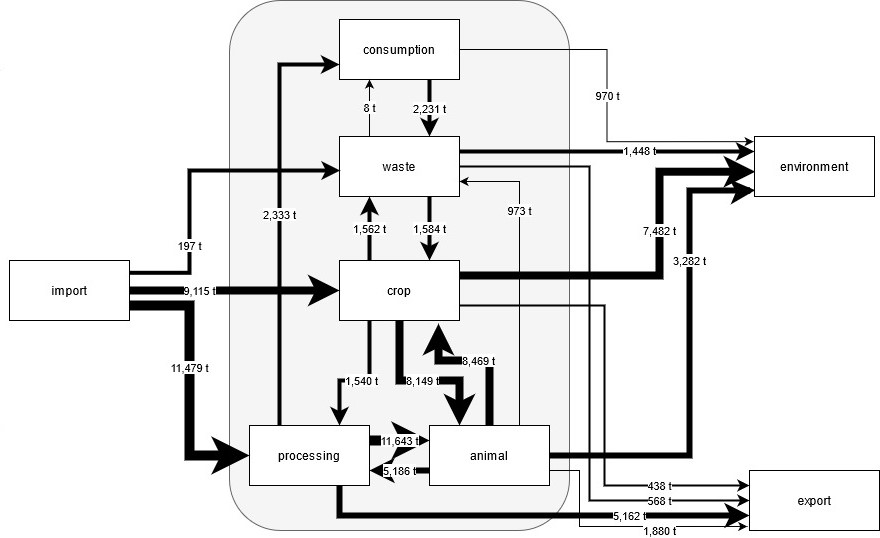

```{r setup, include=FALSE}
knitr::opts_chunk$set(echo = TRUE)
```

## Context

In a research project on nutrient flows in the district of Kleve, Germany several stakeholder coming from different industries (farmers, waste treatment, environmentalists, food processing, scientists) were interviewed. This is a follow-up project on a study were nutrient flows in the agro-food-waste system of Kleve were mapped [@van2021restoring]. A simplified version of the outcomes can be seen for the example of nitrogen flows in the figure below. The study was carried out on a district level, boxes in the Figure represent the studied subsystems crop farming, animal farming, food processing, consumers and waste treatment. The system boundaries are represented in the outer box. Flows between the subsystem were collected from reports, expert estimates and modeled. The study investigated flows of nitrogen (N), phosphorous (P), potassium (K) and to a lesser extent carbon (C). In the figure below the flows were aggregated of numerous individual subsystem interactions, for more details please refer to @van2021restoring.

```{r pressure, echo=FALSE, fig.cap="Nitrogen flows in the agro-food-feed-waste system in Kleve, Germany for the reference year 2020. The nitrogen flows (t) between the subsystems were cumulated. This figure is a modified version of Figure 1 in @van2021restoring", out.width = '70%'}

```

In the current project the nutrient flow calculation were brought to R and are probabilistic instead of deterministic. Furthermore, a scenario deviating fromt the baseline calculations was included. Fore more details on the model please have a look at the [GitHub repo](https://github.com/larscaspersen/DA-nutrient-flow-Kleve)
Stakeholders were asked to give estimates on a theoretical scenario, in which animals in Kleve are exclusively fed using locally sourced (within Kleve) feed stuff. The stakeholder estimates were intended to be used as input for a nutrient flow model on a district level. Questions tackled (1) the allocation (%) of crop biomass to different parts of the subsystems (biogas plants, feed for animals, human consumption), (2) the composition (%) of animals measured in livestock units (for example one dairy cow = ~72 egg-laying hens), (3) the overall change  (%) in livestock units and (4) the allocation (%) of manure to different subsystems (biogas, application on fields, export to other districts). 

Because of the Corona pandemic and more importantly the unwillingness of major stakeholder (especially farmers union) having workshops in the usual decision analysis way were not possible. Instead we opted to have interviews with stakeholders willing to cooperate. These interviews had several caveats: the stakeholders were not properly calibrated, the stakeholders felt extremely uncomfortable to give estimates on these extremely theoretical scenarios and often failed to give estimates in ranges, they were anchored on the allocation in the reference year which was mentioned in the questionnaire and finally, there was no second workshop were stakeholders could give feedback on the collected ranges. 

## Getting stakeholder estimates via questionnaires

We received only few answers and in most cases they were not in ranges. The following diagram shows the stakeholder estimates for the four questions:

1) In reference year 2020 around 67% of produced crops N which were not exported were used to feed animals. The remaining were used for local human consumption (9%) and biogas (24%). How do you think will these allocation change in a local feed scenario?
2) In reference year 2020 the livestock composition (measured in livestock units) in Kleve was 64% cattle, 28% pig, 4% poultry and 4% other animals (horses, sheep, goats). How do you think the composition will change under a local feed scenario?
3) In the reference year 2020 import of feed made up around 45% of the nitrogen allocated to animals in form of feed. In a local feed scenario this amount would be assumed to be missing, but changes in the allocation of crops could substitute parts of it. How strong do you expect the overall livestock population in Kleve to shrink in a local feed scenario?
4) In a local feed scenario manure is more likely to become scarce. In the reference year 2020 around 53% of manure N was exported (most likely Kleve is a transit district for dutch manure, because imports are high as well), 36 % of manure N were applied as fertilizer on crops and 10% of manure N were used as biogas substrate. How do you think will these allocations change in response to the local feed scenario?

There are several problems with the design of the questionnaire I don't want to address in detail. But we can be pretty certain that we locked the interviewed persons by giving them the reference numbers and some questions (like question number 3) were already framed in a direction towards animal reductions. But this is the best we could do at the time and now we have to handle the results.

The diagram below tries to illustrate the answers of the stakeholders. There is one panel for each question and the ticks at the x-axis correspond to the items within the question. The y-axis shows the answers in percent. If the stakeholders answered in a range, the dot shows the mean and the errorbar the range, but in most cases they didn't. The color of the dots correspond to the role of the stakeholders. Bernou interviewed people from the food processing industry, farmers, people in the waste treatment industry, people organised in environmental and nature conversation organizations and scientists from the local university of applied sciences.  


```{r message=FALSE}
library(tidyverse)
answers <- read.csv('stakeholder_answers.csv')

head(answers)
```

```{r}
#create data for of reference year
old_df <- answers[1:11,]
old_df$stakeholder <- c(rep('Reference Year',3), 'Model Output', rep('Reference Year', 7))
old_df$median <- c(24, 67, 9, 45, 63, 28, 4, 4, 53, 10, 36)


ggplot(answers, aes(x = var, y = middle)) + 
  geom_point(position=position_dodge(width=0.5), size = 1.5, aes(col = stakeholder_group)) +
  geom_errorbar(aes(ymin=lower, ymax=upper, col = stakeholder_group), width=.2,
                position=position_dodge(0.5))+
  geom_segment(data = old_df, aes(
    x = c(1:3,1 , 1,3,2,4, 3,1,2) - .45,
    xend = c(1:3,1, 1,3,2,4, 3,1,2) + .45,
    y = median,
    yend = median,
    linetype = stakeholder), col = 'black')+
  facet_wrap(~category, scales = 'free') +
  scale_linetype_manual("", values = c(3,2)) +
  ylab('Stakeholder answers (%)') +
  xlab('') +
  theme_bw() +
  labs(colour='Stakeholder Group')+
  theme(axis.text.x = element_text(angle = 45, vjust = 1, hjust = 1))
```

You can see that in some cases, like the livestock_composition the answers are tightly clustered around the provided reference year values, a classic example of anchoring. For some questions the stakeholders had very different ideas, like in the facet for manure allocation. It seems that the answers are evenly spread across a certain interval. Some trends can be seen, for example most of the stakeholders expect a lower degree of manure export, they just couldn't "agree" on the exact level. But in some cases the stakeholders had completely different ideas about the impact of the scenario. For example the facet for crop allocation (top left) shows drastically different ideas. There is one group of stakeholders that expect and increase in crops allocated to feed and there is a second, somewhat more dispersed group of stakeholders who expect moderate to drastic reductions. And at the same time they expect a drastic increase in crop allocated to humans. And by the way, we can also see that stakeholders were not really consistent in their answers. For example the stakeholder who expects only 10 - 20% of crops allocated to animals only expects a 30% reduction in livestock population. That seems to not add up... In general I was surprised to see a lack of "story" in most of the stakeholders answers, except for the "take feed and give it to humans" trend. Probably the scenario was too abstract and the task was too difficult to give answers which are consistent with each other.


## The challenge

Aside from the biases in the stakeholder answers I described earlier, there are other problems when integrating these answers in a model. First of all, the decisionSupport package needs the 5% and 95% quantiles and not some mean estimates and by the way, even the stakeholders who managed to give ranges probably did not give ranges for these exact quantiles. This shows how important calibration really is! How can I translate these answers into a decisionSupport conformative way? The first idea was to simply take the 5% and 95% quantiles of the answers. But as you can see, there aren't a lot answers (nine to be precise) so the quantiles are not really meaningful. The blue areas in the plot below show the input ranges of that approach


```{r}
#summarise stakeholder input median
answers_summarised <- answers %>% 
  group_by(var, category) %>% 
  summarise(lower = quantile(middle, 0.05),
            upper = quantile(middle, 0.95)) %>% 
  mutate(middle = (upper + lower) / 2)

#this needed to draw shaded areas in the plot
answers_summarised$xmin <- c(1,1,1,2,3,1,2,3,2,3,4) - 0.45
answers_summarised$xmax <- c(1,1,1,2,3,1,2,3,2,3,4) + 0.45

ggplot(answers, aes(x = var)) + 
  facet_wrap(~category, scales = 'free') +
  geom_point(size = 0.001, aes(y = middle), col = 'white')+
  geom_rect(data = answers_summarised, aes(xmin = xmin, xmax = xmax, ymin =lower, 
                                           ymax = upper, group = var, 
                                           fill = 'Input range')) +
  geom_point(position=position_dodge(width=0.5), size = 1.5, aes(col = stakeholder_group, y = middle)) +
  geom_errorbar(aes(ymin=lower, ymax=upper, col = stakeholder_group), width=.2,
                position=position_dodge(0.5))+
  geom_segment(data = old_df, aes(
    x = c(1:3,1 , 1,3,2,4, 3,1,2) - .45,
    xend = c(1:3,1, 1,3,2,4, 3,1,2) + .45,
    y = median,
    yend = median,
    linetype = stakeholder), col = 'black')+
  geom_segment(data = answers_summarised, aes(
    x = xmin,
    xend = xmax,
    y = middle,
    yend = middle,
    linetype = 'Middle of input range'))+
  scale_linetype_manual("", values = c(1,3,2)) +
  scale_fill_manual("", values = c('lightblue')) +
  ylab('Stakeholder answers (%)') +
  xlab('') +
  theme_bw() +
  labs(colour='Stakeholder Group')+
  theme(axis.text.x = element_text(angle = 45, vjust = 1, hjust = 1))


```

Overall this looks okayish, but have a look at the middle of the input range for the crops allocated to feed. The clustered answers indicating an increase are at the range of the distribution (which is normal distributed). This could lead to some issues...

Another idea Bernou and I had was to take the median of the answers and use the median +/- standard deviaion of the answers as an input range. 

```{r}
#summarise stakeholder input median
answers_summarised <- answers %>% 
  group_by(var, category) %>% 
  summarise(sd_answer = sd(middle),
            middle = median(middle)) %>% 
  mutate(upper = middle + sd_answer,
         lower = middle - sd_answer)

#this needed to draw shaded areas in the plot
answers_summarised$xmin <- c(1,1,1,2,3,1,2,3,2,3,4) - 0.45
answers_summarised$xmax <- c(1,1,1,2,3,1,2,3,2,3,4) + 0.45

ggplot(answers, aes(x = var)) + 
  facet_wrap(~category, scales = 'free') +
  geom_point(size = 0.001, aes(y = middle), col = 'white')+
  geom_rect(data = answers_summarised, aes(xmin = xmin, xmax = xmax, ymin =lower, 
                                           ymax = upper, group = var, 
                                           fill = 'Input range')) +
  geom_point(position=position_dodge(width=0.5), size = 1.5, aes(col = stakeholder_group, y = middle)) +
  geom_errorbar(aes(ymin=lower, ymax=upper, col = stakeholder_group), width=.2,
                position=position_dodge(0.5))+
  geom_segment(data = old_df, aes(
    x = c(1:3,1 , 1,3,2,4, 3,1,2) - .45,
    xend = c(1:3,1, 1,3,2,4, 3,1,2) + .45,
    y = median,
    yend = median,
    linetype = stakeholder), col = 'black')+
  geom_segment(data = answers_summarised, aes(
    x = xmin,
    xend = xmax,
    y = middle,
    yend = middle,
    linetype = 'Middle of input range'))+
  scale_linetype_manual("", values = c(1,3,2)) +
  scale_fill_manual("", values = c('lightblue')) +
  ylab('Stakeholder answers (%)') +
  xlab('') +
  theme_bw() +
  labs(colour='Stakeholder Group')+
  theme(axis.text.x = element_text(angle = 45, vjust = 1, hjust = 1))
```

Again, looks more most questions fine. Some of the more extreme answers are not represented anymore by the input range. Furthermore, some new areas which were not represented by stakeholder answers are now covered by the input range, as you can see for the example crop allocated to feed. This is also not ideal. We loose some of the answers and add new ranges not indicated by the stakeholders.

Another idea was to split the problematic stakeholder answers into two groups and model them independently. One could for example split the crop allocated to feed into the group of stakeholders expecting increase in crops allocated to crops and another one for decrease. Similarly, we could split the answers for crops allocated to humans, we could have a group of moderate change and one group expecting strong increase. The second split is a littlebit less well balanced, though. We could leave things as they are for the other groups because there it is more difficult to see distinct groups of answers. We could insert the stakeholder answer ranges per group in the input table and then link them in a `chance_event()` function. The chance variable could be the proportion of stakeholders belonging to a group for example. This link would effectively create a bi-modal distribution. Thanks to Johannes Kopton, who suggested this approach to me. 


```{r}
#add groups to the input table


#summarise stakeholder input median
answers_summarised <- answers %>% 
  group_by(var, category, subgroup) %>% 
  summarise(lower = quantile(middle, 0.05),
            upper = quantile(middle, 0.95),
            n = n()) %>% 
  mutate(middle = (upper + lower) / 2,
         group_weight = n / 9)

#this needed to draw shaded areas in the plot
answers_summarised$xmin <- c(1,1,1,2,2,3,3,1,2,3,2,3,4) - 0.45
answers_summarised$xmax <- c(1,1,1,2,2,3,3,1,2,3,2,3,4) + 0.45

ggplot(answers, aes(x = var)) + 
  facet_wrap(~category, scales = 'free') +
  geom_point(size = 0.001, aes(y = middle), col = 'white')+
  geom_rect(data = answers_summarised[answers_summarised$subgroup == 'a',], aes(xmin = xmin, xmax = xmax, ymin =lower, 
                                           ymax = upper, group = var, 
                                           fill = 'Input range group a')) +
    geom_rect(data = answers_summarised[answers_summarised$subgroup == 'b',], aes(xmin = xmin, xmax = xmax, ymin =lower, 
                                           ymax = upper, group = var, 
                                           fill = 'Input range group b')) +
  geom_point(position=position_dodge(width=0.5), size = 1.5, aes(col = stakeholder_group, y = middle)) +
  geom_errorbar(aes(ymin=lower, ymax=upper, col = stakeholder_group), width=.2,
                position=position_dodge(0.5))+
  geom_segment(data = old_df, aes(
    x = c(1:3,1 , 1,3,2,4, 3,1,2) - .45,
    xend = c(1:3,1, 1,3,2,4, 3,1,2) + .45,
    y = median,
    yend = median,
    linetype = stakeholder), col = 'black')+
  geom_segment(data = answers_summarised, aes(
    x = xmin,
    xend = xmax,
    y = middle,
    yend = middle,
    linetype = 'Middle of input range'))+
  scale_linetype_manual("", values = c(1,3,2)) +
  scale_fill_manual("", values = c('lightblue', '#FF9999')) +
  ylab('Stakeholder answers (%)') +
  xlab('') +
  theme_bw() +
  labs(colour='Stakeholder Group')+
  theme(axis.text.x = element_text(angle = 45, vjust = 1, hjust = 1))
```

Okay this plot is getting a bit loaded but bear with me. There are again some drawbacks to this approach. The area in between the groups is not really well represented, there is no reason for us to believe that there won't be anything in the gaps. Also the upper group in crops allocated to feed looks really clustered.


Another idea would be to have skewed distributions, instead of normal ones. This way we could acknowledge what most stakeholder expect to see without loosing the more "extreme" answers. Unfortunately, there is no routine within the decisionSupport package that can handle that. But I played around a little bit and I found a way to add this to your own model function (but I don't know how to add this to the decisionSupport package).

```{r message=FALSE}

library(sn) #package to handle skewed distributions within R

#this approach was adopted from a post on stack exchange, but I can't find the post anymore
#the idea is to find a skewed distribution, which describes the given quantiles and mean the best
#the function returns the residual sum of squares for the observed quantiles and calculated quantiles for
#the fitted distribution
#the goal is to find the parameters xi, omega and alpha, which describe a skewed normal distribution
model <- function(x, parms) {
  omega = x[1]
  alpha = x[2]
  m = parms[1]
  p05 = parms[2]
  p95 = parms[3]
  xi = m - omega*alpha*sqrt(2/(pi*(1+alpha^2)))
  
  return ((p05 - qsn(0.05, xi, omega, alpha))^2 +
          (p95 - qsn(0.95, xi, omega, alpha))^2)
  
  
}

#we take the quantiles and mean from the answer we are interested in
q05 <- quantile(answers$middle[answers$var == 'crop_feed'], 0.05)
q95 <- quantile(answers$middle[answers$var == 'crop_feed'], 0.95)
m <- mean(answers$middle[answers$var == 'crop_feed'])

#we use an aoptimzation function to find the set of parameters which give the lowest
#error. We also need to provide lower and upper bounds (which I chose more or less randomly)
#and we need to define a search method (I also chose something random, to be honest)
res <- optim(par = c(12, 1), fn = model, parms = c(m, q05, q95), method = "Nelder-Mead", 
      lower = c(0.01, -1000), upper = c(1000,1000))

#we calculate the parameter xi for the results
xi <- (m - res$par[1]*res$par[2]*sqrt(2/(pi*(1+res$par[2]^2))))


#here is a plot of the fitted distribution
x <- seq(0, 120, by=0.2)
plot(sn::dsn(x, omega = res$par[1], alpha = res$par[2], xi = xi), x = x)

```

This could be promising. I decided to compare the different distributions resulting from the different processing approaches. 

```{r}
#here is an example for the crops allocated to feed

#number of random draws, usually is 10,000
nsim <- 10000

raw_quantiles <-  decisionSupport::rtnorm_0_1_90ci(n = nsim, 
                                                   lower = quantile(answers$middle[answers$var == 'crop_feed'], 0.05) / 100,
                                                   upper = quantile(answers$middle[answers$var == 'crop_feed'], 0.95) / 100,
                                                   correlationMatrix = 1)

#calculate median, standard deviation
med <- median(answers$middle[answers$var == 'crop_feed']) / 100
sd <- sd(answers$middle[answers$var == 'crop_feed'] / 100) 
upper <- ifelse(med + sd > 0.98, yes = 0.98, no = med + sd)
lower <- ifelse(med - sd < 0.01, yes = 0.01, no = med - sd)

#using median and plus minus sd
sd_way <- decisionSupport::rtnorm_0_1_90ci(n = nsim, lower = lower, upper = upper ,correlationMatrix = 1)

#create distribution for skewed distribution
skewed_way <- sn::rsn(n = nsim, xi = xi, omega = res$par[1], alpha = res$par[2])


#split groups and link with chance event

#caluclate upper and lower boundary of the two groups
upper_g1 <- max(answers$middle[answers$var == 'crop_feed' & answers$subgroup == 'a']) / 100
lower_g1 <- min(answers$middle[answers$var == 'crop_feed' & answers$subgroup == 'a']) / 100
upper_g2 <- max(answers$middle[answers$var == 'crop_feed' & answers$subgroup == 'b']) / 100
lower_g2 <- min(answers$middle[answers$var == 'crop_feed' & answers$subgroup == 'b']) / 100

#draw numbers for both groups independently
g1 <- decisionSupport::rtnorm_0_1_90ci(n = nsim, lower = lower_g1, upper = upper_g1 ,correlationMatrix = 1)
g2 <- decisionSupport::rtnorm_0_1_90ci(n = nsim, lower = lower_g2, upper = upper_g2 ,correlationMatrix = 1)

#weight of group1
weight_g1 <- length(answers$middle[answers$var == 'crop_feed' & answers$subgroup == 'a']) / length(answers$middle[answers$var == 'crop_feed'])

#object to store the final result
chance_way <- c()

for(i in 1:nsim){
  chance_way[i] <- decisionSupport::chance_event(weight_g1, value_if = g1[i], value_if_not = g2[i])
}


#bind everything to one data.frame
dist_df <-  rbind(data.frame(value = chance_way, type = 'chance_event'),
data.frame(value = skewed_way / 100, type = 'skewed_distribution'),
data.frame(value = raw_quantiles, type = 'raw_answers_quantiles'),
data.frame(value = sd_way, type = 'median_answer_and_sd'))

#visualize the distribution
ggplot(dist_df, aes(x = value)) + 
  geom_histogram(bins = 150) + 
  geom_vline(xintercept = answers$middle[answers$var == 'crop_feed'] / 100, col = 'red')+
  facet_wrap(~type, scales = 'free_y', ncol = 1, nrow = 4) + 
  xlim(0,1) + 
  theme_bw()

```

The figure above shows the distributions that result from the different approaches to integrate the raw stakeholder estimations. The answers of the stakeholders are represented by red vertical lines, the distributions are shown in the histogram. Each approach has some advantages and disadvantages. The chance event approach with splitting the stakeholder answers into groups makes sure that each answer is represented and that the groups with larger consensus among the stakeholder also gets more weight. But there are several problems: the right hand group seems to have little variation because the answers were tightly clustered. I think the variation and uncertainty is not well captured in this group. But the more concerning characteristic of this approach is the space between the two groups. In the context of the question it does not make sense, that the values from around 0.6 and 0.7 are not represented at all. 

The median +/- sd approach was more of a desperate idea, because it reduces the influence of the more extreme answers without loosing them completely. It is nice to see, that the peak of the distribution lies close to the right hand cluster where the majority of the stakeholder answers lied. The scattered answers on the left hand side were also reasonably well captured, except maybe the most left one. However, it is concerning to see. that a large chunk of the distribution lies where no of the answers are, especially on the interval of 0.8 to 1. 

The "raw_answers_quantiles" approach was how we initially planned to integrate the answers. This might work well if you have many answers, but we ended up having only 9... The right hand side group were most answers lied is not well captured, it is at the upper tail of the distribution now. Instead, the peak is located in an area were few answers lie. This is a really unsatisfying outcome.

Luckily we had a fourth idea, the skewed distribution approach. This is not implemented in the decisionSupport package, though. The peak of the distribution is at the right hand answer group. The more extreme and scattered answers are also captured on the left with an gradual increase towards the right hand side. Soon after the right hand group the distribution steeply declines at around 0.8. I like the values between the groups is reasonably well captured and that the values far to the right were non of the answers lied are not captured, unlike for example in "median_answer_and_sd". The skewed distribution approach seems to me like the best compromise, the trend is captured without loosing the more extreme answers. 


## Outlook

Right now the skewed distribution approach is not part of the decisionSupport package. Integrating it requires some programming effort, especially because the package works with classes and I don't have any experience with that. Instead I will probably fit the distributions in a separate script for each question, were I think that the "raw_answer_quantile" approach failed. The fitted parameters can be part of the input file, probably as a constant. Then I will draw in the beginning of the decision model a random value from the fitted distribution. The downside is, that the drawn value is not part of the input values of the mcSimulation object (and thus they are not part of any post-hoc analysis). 


## References